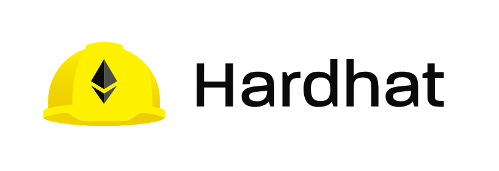
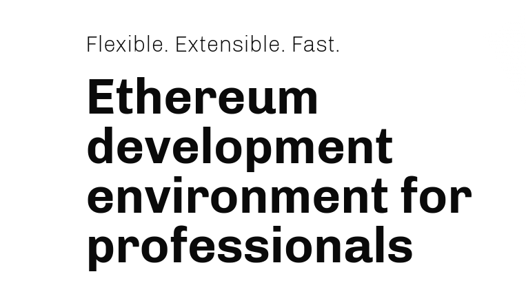
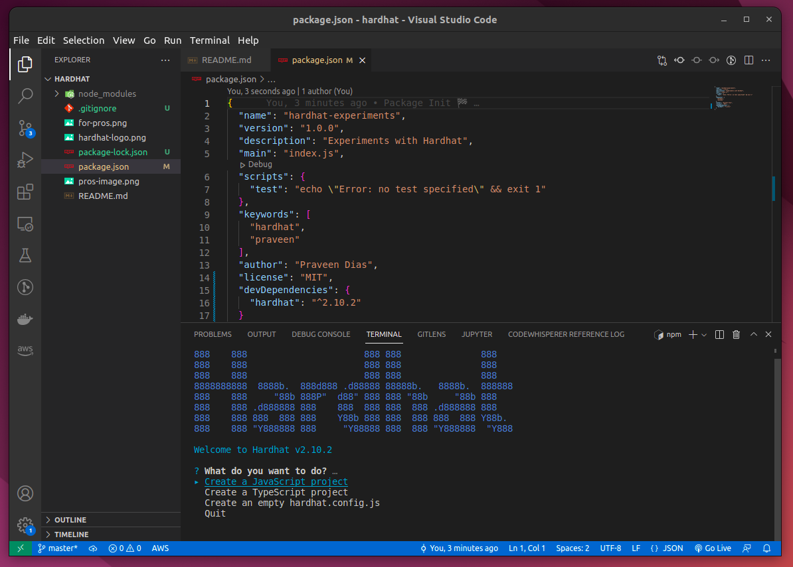

# Hardhat

Hardhat is an Ethereum development environment. Compile your contracts and run them on a development network. Get Solidity stack traces, console.log and more.

https://hardhat.org/

# Hardhat Init

