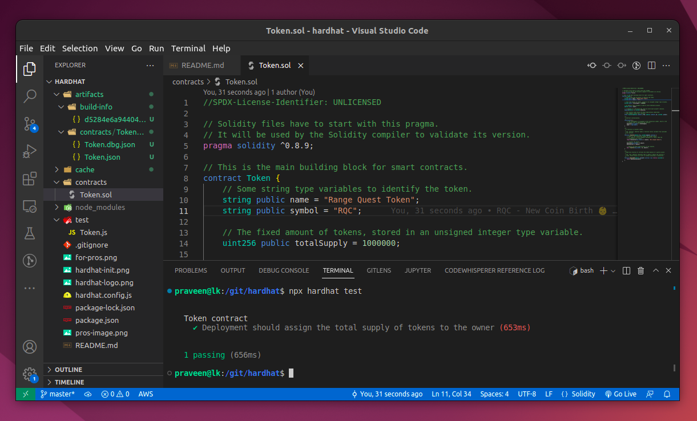

# Hardhat

Hardhat is an Ethereum development environment. Compile your contracts and run them on a development network. Get Solidity stack traces, console.log and more.

https://hardhat.org/

# Hardhat Init

# ERC-20 (Standard for Fungible Tokens)

## ERC-20 (Ethereum Request for Comments 20)

The ERC-20 (Ethereum Request for Comments 20), proposed by **Fabian Vogelsteller** in November 2015, is a Token Standard that implements an API for tokens within Smart Contracts.

What is a Token?

Tokens can represent virtually anything in Ethereum:

- reputation points in an online platform
- skills of a character in a game
- lottery tickets
- financial assets like a share in a company
- a fiat currency like USD
- an ounce of gold
- and more...

https://ethereum.org/en/developers/docs/standards/tokens/erc-20/

https://eips.ethereum.org/EIPS/eip-20

**NOTE:** *ERC-721 NON-FUNGIBLE TOKEN STANDARD*

# Testing Solidity Contracts

